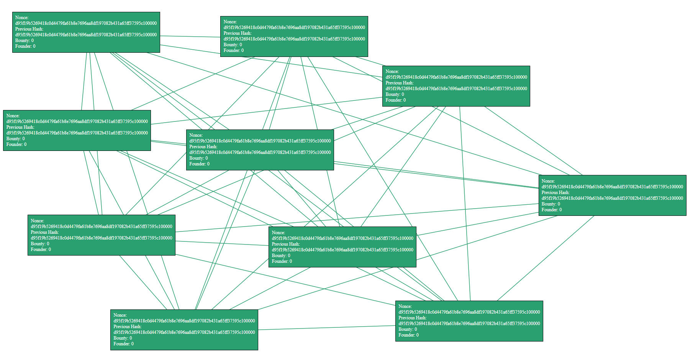

# Info0903-Blockchain

## État du projet

- Réalisation d'une blockchain :
  - Gestion d'un mineur
    - - [x] Sa création
    - - [x] Son fonctionnement sur une machine
    - - [x] Sa communication avec d'autres mineurs avec l'envoi et la réception de mail
    - - [x] Être capable de générer, aléatoirement dans le temps, une transaction aléatoire
    - - [x] _Optionnel : l'argent d'un mineur est calculé grâce à la blockchain et non au fûr et à mesure de la réalisation de blocks_ 
    - - [ ] _Optionnel : ajouter un mineur à la liste des mineurs connus pendant l'exécution du programme_
    - - [x] _Optionnel : intégrer la théorie des jeux pour faire fonctionner la blockchain (sûrement vis-à-vis de l'adaptation de la difficulté)_
  - Génération d'un hash _(ou nonce)_
    - - [x] Hash correspondant à certains critères
  - Création d'une transaction
    - - [x] Un envoyeur
    - - [x] Un receveur
    - - [x] Une valeur monétaire
  - Création d'un block
    - - [x] Un nonce
    - - [x] Le hash du block précédent
    - - [x] Une récompense
    - - [x] Une transaction
    - - [x] Un trouveur
  - Partage des blocks trouvés
    - - [x] Broadcast du block à toute la liste des mineurs connus
- Broadcast d'un block
  - - [x] Récupération des données du block à broadcaster
  - Génération des mails nécessaires
    - - [x] Choix des destinataires
    - - [x] Nommage de l'objet avec un format spécifique
    - - [x] Corps du mail _(si souhaité)_
    - - [x] Mise en pièce jointe du fichier JSON contenant les données du block à partager
  - - [x] Envoi d'un mail
  - Récéption d'un mail
    - - [x] Vérifier que le mail reçu est bien un mail de broadcast et non un autre
  - Récupération des données d'un mail
    - - [x] Reprendre les données dans un fichier au format JSON
    - - [x] Placer ledit fichier dans le dossier du projet attribué
    - - [ ] Vérifier la blockchain ainsi récupérée
- Affichage du projet
  - Création d'une interface web pour la visualisation de l'évolution de la création des blockchains
    - - [x] Gestion d'une partie serveur sur chaque machine _(récupération des données avec Python)_
    - - [x] Gestion d'une partie client sur chaque machine _(récupération des données avec HTML et JavaScript)_ 
  - - [ ] Affichage lisible
  - - [x] Les blocks d'une blockchain sont liés entre eux sous forme de suite pour pouvoir retracer l'ordre de création des blocks
  - - [x] Différenciation des différentes blockchains
- [x] Possibilité de créer un fichier.py qui exécute le serveur puis le programme pour éviter d'avoir à exécuter les deux programmes séparément

## Description du projet

L'objectif du projet d'Info0903 est de recréer le principe d'une blockchain. Nous avons donc
plusieurs mineurs qui minent, chacun de leur côté, des blocks (qui forment une blockchain).
Ces blocks contiennent un nonce, un hash précédent, une valeur de bounty (monnaie à
remettre au mineur qui trouve le block), une transaction, un trouveur et la date àa laquelle le block est trouvé. Une transaction est
constituée d'un envoyeur, d'un receveur et d'une quantité de monnaie échangée. Un mineur
possède un identifiant, une blockchain (qui n'est que la suite de blocks du mineur), une liste
de mineurs connus (qui constitue en quelque sorte un serveur peer to peer), une quantité
d'argent, une liste de blocks en attente (qui sont simplement des blocks à vérifier, par
exemple lorsqu'un autre mineur réalise un broadcast de son block) et enfin une liste de
transactions à réaliser. Il possède aussi un mail ainsi qu'un mot de passe pour pouvoir échanger des blocks avec
les autres mineurs.

Le broadcast de block est réalisé par un envoie de mail à chaque mineur faisant partie de la
liste des mineurs connus. Lorsqu'un mineur reçoit un block par mail, celui-ci est extrait et est
vérifié dans l'immédiat. On considère pour le moment que chaque block est correct, mais il
sera possible de réaliser des blocks faux ou des mineurs qui souhaitent tricher par la suite.

Un affichage de toutes les blockchains est disponible grâce à une interface web. Celle-ci est
toujours en cours de développement. Elle récupère chaque blockchain dont elle a l'accès et
les affiche par groupe (un mineur = une blockchain = un groupe de blocks) avec une couleur
distincte et aléatoire par groupe.

Chaque machine possédant le programme aura accès à la blockchain de son propre mineur,
ainsi qu'aux blockchains des mineurs de la liste des mineurs connus. Cet accès aux autres blockchains
est possible grâce au broadcast des autres mineurs.

Une possibilité est de voir pour pouvoir ajouter un mineur pendant que le programme est en cours d'exécution.

L'idéal serait chaque mineur génère une transaction aléatoirement dans le temps entre lui (qui serait l'envoyeur)
et un autre mineur de son cercle de mineurs. L'argent envoyé serait alors débité de son compte.
Il serait possible ainsi de faire des vérifications sur l'argent restant et celui envoyé. L'idéal, d'après le prof,
serait de vérifier l'argent restant en comparant l'argent initial et en comptant l'argent débité de son compte
depuis la blockchain.

## Installation

Pour pouvoir exécuter le programme sans problème, il faut avoir les fichiers suivants :

- [ ] blockchain.py
- [ ] transaction.py
- [ ] block.py
- [ ] miner.py
- [ ] program_blockchain.py
- [ ] requirements.txt
- [ ] private.json
- [ ] listMail.json

Pour pouvoir avoir l'interface graphique liée au programme, il faut avoir les fichiers suivants :

- [ ] affichage.py
- [ ] interface.html

Pour pouvoir exécuter l'interface WEB ainsi que le programme de manière simultanée avec uniquement un fichier :

- [ ] program.py

Il faut aussi installer les différents packages nécessaires au bon fonctionnement de l'application. Les noms des packages sont contenu dans le fichier "__requirements.txt__" présent à la racine du projet.

```bash
pip install -r ./requirements.txt
```

## Utilisation

Pour faire fonctionner le programme, il faut simplement :
- Exécuter le fichier "__program_blockchain.py__" pour exécuter le programme qui gère la
blockchain. Il faut faire attention pour le moment, car les mineurs sont créés avec un
identifiant allant de 0 à x, en fonction du nombre de mineurs créés sur la machine. Il
faudra donc gérer autrement la création de l'identifiant d'un mineur.
- Exécuter le fichier "__app.py__" pour créer un serveur qui permettra d'ouvrir le fichier
"__templates/index.html__" qui est la partie client et qui gère l'affichage des blockchains accessibles
depuis la machine. Pour le moment, il faut actualiser manuellement la page web pour
voir la progression de la création de la blockchain. Une actualisation automatique existe
mais dérange lorsque l'on souhaite bouger les différents blocks. Cette partie client
permet de visualiser les blockchains de chaque mineur que la machine connaît et de
déplacer les blocks avec un simple cliqué déposé. Chaque block faisant partie d'une
blockchain est relié à tous les autres blocks de sa blockchain. Un travail est en cours
pour que les blocks ne soient reliés qu'aux blocks précédent et suivant de leur
blockchain pour améliorer la visibilité.
Il peut être nécessaire de bouger les blocks afin de tous les voir.

## Configuration

Il faut configurer le fichier "__private.json__" en inscrivant l'email du mineur de la machine _(pour qu'il puisse broadcaster sa blockchain)_
ainsi que le mot de passe _(qui correspond au mot de passe d'application du compte email)_.

Il sera possible, à l'avenir, qu'il faille indiquer les mineurs connus, peut-être grâce à un fichier JSON. ___À méditer.___

## Licence

Le projet est réalisé en langage Python, sous la version 3.10 dudit langage. On peut
également parler de l'utilisation des langages HTML 5 et JavaScript pour la partie interface
web.

## Auteurs

Le projet est réalisé en binôme par __NOUZILLE Jarod__ et __BOUGY Baptiste__.

## Changelog

#### Version 0.9.4

- Calcul de l'argent restant d'un mineur ajouté en fonction "___get_balance(self)___" dans le fichier "__miner.py__".
- Modification du fichier "__block.py__" : Les variables "___bounty___" et "___transaction.quantity___" étaient fixées à 0 dans la fonction "___to_json(self)___".

##### _Baptiste_

#### Version 0.9.3

- Modification du fichier "__miner.py__" : création de tous les répertoires nécessaires au fonctionnement du mineur créés dans la fonction "___create_repositories(self)___". Toutes les parties du code qui gèrent ça sont modifiées ou supprimées en conséquence.
- Correction du problème de récupération des fichiers JSON contenant les blockchains par mail.
- Transformation du fichier "__blockchain.json__" récupéré en un fichier par block trouvé. Le nom du fichier est la date de création du block.
- Tentative de recalculer le nonce de chaque block trouvé par un autre mineur. Les nonces diffèrent mais l'idée a été implémentée dans le fichier "__miner.py__".
- Renommage du fichier "__app.py__" en "__affichage.py__".
- Renommage du fichier "__index.html__" en "__interface.html__".
- Création de réelles Docstrings dans les fichiers "__miner.py__", "__affichage.py__", "__transaction.py__", "__blockchain.py__", "__block.py__", "__program_blockchain.py__".

##### _Baptiste_

#### Version 0.9.2

- Suppression des fichiers "__ReadMe_Info0903.pdf__", "__affichage.py__" et "__d.py__" qui sont inutiles depuis plusieurs versions et prennent inutilement de la place.
- Commentaire du code du fichier "__miner.py__"
- Modification du fichier "__miner.py__" : ajout des variables "___self.time_last_block_mined___", "___self.time_new_block_mined___" et "___self.difficulty___" qui permettront de recalculer la difficulté en fonction du temps passé pour miner un block. La fonction "___create_nonce(self, block_info)___" a été déplacée dans la classe pour intégrer la nouvelle variable "___self.difficulty___" (qui remplace l'ancienne variable "___zero_number___"). La fonction "___mine_next_block(self, transaction)___" a été modifiée pour intégrer le code qui permet de recalculer la difficulté. La difficulté reste inchangée lorsque le block est miné entre 5 et 15 secondes. La difficulté initiale est descendue à 1 pour voir l'évolution de la difficulté.
- Désactivation du debugger dans le fichier "__app.py__" pour permettre son lancement depuis le fichier "__program.py__" _(la bibliothèque "__multiprocessing__" ne permet pas d'exécuter du flask en mode debug)_.
- Ajout de la vérification de l'existence du répertoire "__Miner_Zone__" dans la fonction "___blockchain_research()___" dans le fichier "__app.py__" pour éviter de faire planter le programme.
- Commentaire du code du fichier "__app.py__".
- Commentaire du code du fichier "__program_blockchain__".

##### _Baptiste_

#### Version 0.9.1

- Correction de l'affichage dans le fichier "__index.html__" : tous les blocks d'un même mineur ne sont plus liés entre eux. Un block possédant un "___nonce___" sera lié avec un autre block dont le "___previous_hash___" est égal audit "___nonce___", et ce, pour chaque mineur. Cela signifie que si deux mineurs distincts ont chacun la même blockchain, les deux blockchains ne seront pas liées entre elles.
- Modification du fichier "__miner.py__" : dans la fonction "___read_email(self)___", récupération de l'identifiant de l'envoyeur du block. Si l'envoyeur n'est pas connu, celui-ci est ajouté à la liste des mineurs connus. Si l'envoyeur n'a jamais communiquer sa blockchain et qu'il le fait pour la première fois, un dossier à son nom est créé dans le répertoire "__Miner_Zone__" pour y stocker sa blockchain. _À corriger, voir section des problèmes recensés._

##### _Baptiste_

#### Version 0.9

- ___Passage d'un cap avec l'emailing.___
  - _Test de l'envoi et de la réception de blockchain par mail. Statut : opérationnel._
- Modification du fichier "__miner.py__" : ajout de la possibilité de générer une nouvelle transaction par un mineur. L'envoyeur est le mineur qui génère la transaction, le receveur est un mineur aléatoire dans la liste des mineurs connus et le montant est une valeur aléatoire entre 0 et l'argent total du mineur. Son argent total se voit déduit du montant de la transaction générée. _Il serait peut-être mieux que ce ne soit jamais déduit et que le montant total restant soit, comme le voudrait le prof, vérifié lors de la génération du block._
- Modification du fichier "__program_blockchain.py__" : modification du contenu qui est passé à la variable "___miner.l_contact_miners___". On passe en paramètres une liste de "__str__" plutôt qu'une liste de "__miner__". La liste de "__str__" passée contient les corps de mail des mineurs connus _(ceux présents dans le fichier "__mailList.json__")_. Le fichier "__miner.py__" a été modifié pour prendre en compte cette modification.
- Modification du fichier "__miner.py__" : changement de la procédure "___broadcast()___". Celle-ci s'occupe désormais d'envoyer les mails et prend maintenant en paramètres "___block___" qui est le block à broadcaster _(à voir si on ne passe pas une blockchain complète, je regarderai rapidement)_, "___identifiers___" qui représente les identifiants du compte mail qui broadcast et "___known_miners___" qui est simplement une liste des mineurs connus à qui on broadcast le block trouvé. La procédure "___envoi_mail(blockchain_json: json, private_mail: json, list_mail: json)___" est désormais passé de la fonction "___run()___" à la procédure "___broadcast(block, identifiers, known_miners)___".
- Modification du fichier "__miner.py__" : retirement automatique de l'identifiant du mineur de sa propre liste de mineurs connus.
- Modification du fichier "__miner.py__" : génération des transactions initiales d'un mineur dans celui-ci plutôt que dans le fichier "__program_blockchain.py__" à la création d'un mineur.
- Modification du fichier "__block.py__" : réglage d'un problème de valeur et d'affichage, le bounty était fixé à 0 et l'affichage de la valeur monétaire échangée dans une transaction était fixée à 0.
- Modification du fichier "__program.py__" : intégration de "___multiprocessing___" pour permettre le fonctionnement simultané du programme de simulation de blockchain ainsi que le serveur pour l'interface. Le fichier est désormais fonctionnel.
  - _Remarque : un trop grand nombre de blocks à afficher fait charger l'interface WEB indéfiniment._

##### _Baptiste_

#### Version 0.8.3

- Implémentation complète de l'envoi et de la réception de mail (à voir cependant pour passer mail et password en attribut de miner et donc bouger l'envoi de mail directement dans la classe "___Miner.py___").
  - _Piste pour plus tard : peut-être que le private.json sera récupéré en attribut de miner, ce sera plus simple, je pense._

##### _Jarod_

#### Version 0.8.2

- Modification des fichiers "__miner.py__" et "__app.py__" : accès au répertoire "__Miner_Zone__" depuis le dossier courant plutôt que depuis la racine de l'ordinateur.
- Modification du fichier "__miner.py__" : création automatique du répertoire "__Miner_Zone__" dans le dossier courant si celui-ci n'existe pas
- Modification du fichier "__miner.py__" : création d'un fichier JSON avec la date complète en nom.
- Modification du fichier "__miner.py__" : génération d'un nonce à partir de toutes les informations d'un block.
- Modification du fichier "__miner.py__" : l'identifiant du mineur sera à présent le corps de l'adresse email lié au mineur. _(exemple : info18962 au lieu de info18962@gmail.com)_. Le temps de calcul étant devenu trop long, la difficulté est passée de 5 à 4 pour rendre le programme utilisable.
- Modification du fichier "__miner.py__" : ajout d'une variable de classe "___self.previous_hash___" pour qu'un nouveau block est bien le hash du block précédent et non le même hash que le nonce.
- Création du fichier "__program.py__" pour exécuter le serveur "__app.py__" puis le programme de la blockchain "__program_blockchain.py__". Modification en conséquence des fichiers "__program_blockchain.py__" et "__app.py__" pour qu'ils puissent fonctionner seuls ou en étant exécutés par un autre programme.
- Modification du fichier "__miner.py__" : suppression de la fonction "___is_nonce(nonce)___" qui était devenu obsolète depuis la version 0.8. Le code a été adapté pour prendre en compte ce changement.
- Modification du fichier "__miner.py__" : transformation de la variable "___self.waiting_block___" de block à liste de blocks et modification en conséquence du programme.
  - _Remarque : Depuis le changement ci-dessus, la génération de hash montre sa demande de puissance de calcul. Un nonce peut prendre 2s comme plusieurs minutes pour être calculé. À voir si il faudra baisser ou non la difficulté._

##### _Baptiste_

#### Version 0.8.1

- Ajout de la surcharge de l'opérateur + dans "__blockchain.py__" ainsi que de len
- Ajout des fonctions d'envoi et de réception de mails dans "__miner.py__"
- Création d'une fonction "___to_json()___" dans block.py
- Modification du présent __README__
- Création d'un requirements.txt pour faciliter l'installation des packages
- Déplacement d'index.html dans le répertoire "templates" => jinja2 cherche les templates directement dedans sinon impossible de réussir à le faire fonctionner sur ma machine (peut être parce que je suis en python 3.11)
- Utilisation d'___os.getcwd()___ et d'___os.sep___ pour les chemins vers le répertoire "__Miner_Zone__" (plus besoin de le modifier, j'attends ton retour)
- Création d'un __.gitignore__

##### _Jarod_

#### Version 0.8

Cette dernière version vient avec les modifications des fichiers suivants :
- "__miner.py__" pour la nouvelle génération de hash
- "__block.py__" pour la nouvelle génération de fichier JSON
- "__app.py__" pour la gestion du côté serveur de l'interface web
- "__index.html__" pour la gestion du côté client de l'interface web
- "__program_blockchain.py__" pour changer la façon d'exécuter le programme et l'affichage

##### _Baptiste_

## Problèmes connus

- [x] ~~Un problème lié à la gestion du dossier "Miner_Zone" est recensé. Celui-ci doit être
manuellement implémenté.~~
- [x] ~~Un problème lié à la position du dossier "Miner_Zone" est recensé. L'emplacement doit
être manuellement modifié dans le code des fichiers "miner.py" et "app.py".~~
- [x] ~~_Optionnel_ Un problème lié au lien entre les blocks d'une même blockchain. En effet, tous les
blocks sont actuellement liés entre eux lorsqu'ils font partis d'une même blockchain.~~
- [ ] _Optionnel_ Un problème lié à l'actualisation de l'interface web est recensé. Il faut actualiser
manuellement la page pour actualiser l'affichage des blockchains disponibles sur la
machine. Une version automatique existe, mais n'est guère plus intéressante. Elle
replace tous les blocks à leur endroit initial, tous les x secondes.
- [x] ~~Un problème lié aux identifiants des mineurs est recensé. Un mineur est actuellement
créé automatiquement avec un identifiant allant de 0 (pour le 1er mineur créé sur une
même machine) jusqu'à x (x étant le nombre de mineurs souhaité sur la même
machine).~~
- [x] ~~Un problème lié à la génération d'un nonce est recensé. Un nonce doit être généré à
partir d'un nombre ou d'un texte, mais la génération est globalement trop simple.~~
- [x] ~~Un problème lié à la génération d'une transaction est recensé. Le contenu d'une
transaction doit être automatiquement générée de manière aléatoire, mais les
transactions sont toutes identiques.~~
- [x] ~~Le nom du fichier JSON doit correspondre à la date exacte de la création dudit fichier, hors, il correspond actuellement au numéro du block _(commençant par 0)_.~~
- [x] ~~Il faut pouvoir générer des transactions pendant que le programme est en cours d'exécution.~~
- [x] ~~Il faudra faire attention pour créer les répertoires des mineurs voisins, en faisant attention à bien récupérer leur identifiant et non leur mail complet.~~
- [x] ~~Il est peut-être un peu lourd d'exécuter séparément les fichiers "__program_blockchain.py__" et "__app.py__" pour pouvoir lancer la blockchain et le serveur pour l'interface graphique.~~
- [x] ~~Il faut implémenter les threads ou les processus dans le fichier "__program.py__" pour pouvoir exécuter en simultané l'affichage et la génération de blockchain.~~
- [x] ~~Il faut retirer l'identifiant du mineur de sa propre liste de mineurs connus pour éviter qu'il ne fasse des transactions à lui-même.~~
- [ ] Un trop grand nombre de block à afficher engendre un chargement infini de l'interface WEB.
- [x] ~~La création de dossiers pour les mineurs connus ne fonctionne pas comme prévu. Les dossiers sont créés à l'infini à l'intérieur du dossier du mineur de la machine.~~
- [ ] Le recalcul d'un nonce pour vérifier qu'il soit correct ne fonctionne pas. Les nonces trouvés sont différents.
- [ ] D'autres problèmes sont recensés et doivent être ajoutés ici.

## Visuels

Docstring de base :
```Python
"""
    Présentation de la fonction/procédure.
    :param paramètre1: présentation du paramètre1
    :type paramètre1: type paramètre1
    :return: présentation de ce qui est retourné
    :rtype: type paramètre de retour
"""
```
Exemple :
```Python
"""
    Fonction pour générer le nonce d'un block en fonction des informations de la transaction
    :param block_info: Contient toutes les informations à transformer en hash
    :type block_info: str
    :return: Retourne le nonce généré à partir de SHA256, devant contenir quatre 0 à la fin du hash
    :rtype: str
"""
```

Docstring de classe :
```Python
"""
    Présentation de la fonction/procédure.
    :param paramètre1: présentation du paramètre1
    :type paramètre1: type paramètre1
    
    :Example:
    
    >>> # Code de l'exemple
    
    .. seealso:: les fonctions à voir
    
    Attirer l'attention
    -------------------
    
    Texte descriptif d'attirer l'attention.
"""
```
Exemple :
```Python
"""
    Une classe permettant de simuler un mineur recherchant des blocks pour alimenter sa blockchain.
    :param identifier: Équivaut à l\'identifiant du mineur. On considère que c\'est le corps de son adresse mail pour éviter les doublons ;
    :param mail: Équivaut à l\'adresse email du mineur ;
    :param balance: Équivaut à la valeur monétaire du mineur.
    :type identifier: str
    :type mail: str
    :type balance: int

    :Example:

    >>> Miner(identifier="exemple", mail="exemple@gmail.com", balance=50)

    .. seealso:: add(miner), run(), create_repositories(), create_nonce(block_info), mine_next_block(transaction), validate_block()\n

    Important
    ---------

    Cette classe est obligatoire pour le programme de simulation d'une blockchain.
"""
```

Visualisation d'un fichier JSON :
```json
{"nonce": "dbd71f5a6099f59be56bd80e2ee54e37f884b80b6b439488b460f067a7ee0000", "previous_hash": "194989fd263865ece964298be5317c0ba44b934cc519c8cc6032692d0fb20000", "bounty": 0, "transaction": {"sender": "bc2.info0903", "receiver": "bc2.info0903", "quantity": 0}, "founder": "bc2.info0903", "date": "10/01/2024 15:05:21"}
```
Soit :
```json
{
  "nonce": "dbd71f5a6099f59be56bd80e2ee54e37f884b80b6b439488b460f067a7ee0000",
  "previous_hash": "194989fd263865ece964298be5317c0ba44b934cc519c8cc6032692d0fb20000", 
  "bounty": 0, 
  "transaction": 
  {
    "sender": "bc2.info0903", 
    "receiver": "bc2.info0903", 
    "quantity": 0
  }, 
  "founder": "bc2.info0903", 
  "date": "10/01/2024 15:05:21"
}
```

Visualisation du fichier "__private.json__" :

```json
{
    "mail": "bc2.info0903@gmail.com",
    "password": "xxcc erxw zkyf xxlh"
}
```

Interface web du côté client :



Interface en action :


Ce que contient la partie serveur :

```bash
Werkzeug appears to be used in a production deployment. Consider switching to a production web server instead.
 * Serving Flask app 'app'
 * Debug mode: on
WARNING: This is a development server. Do not use it in a production deployment. Use a production WSGI server instead.
 * Running on http://127.0.0.1:5000
Press CTRL+C to quit
 * Restarting with stat
Werkzeug appears to be used in a production deployment. Consider switching to a production web server instead.
 * Debugger is active!
'ioreg' n'est pas reconnu en tant que commande interne
ou externe, un programme ex�cutable ou un fichier de commandes.
 * Debugger PIN: 921-711-227
Block: {'nonce': 'd95f19b5269418c0d4479fa61b8e7696aa8df197082b431a65ff37595c100000', 'previous_hash': 'd95f19b5269418c0d4479fa61b8e7696aa8df197082b431a65ff37595c100000', 'bounty': 0, 'transaction': {'sender': 0, 'receiver': 0, 'quantity': 0}, 'founder': 0, 'miner': 1}
Block: {'nonce': 'd95f19b5269418c0d4479fa61b8e7696aa8df197082b431a65ff37595c100000', 'previous_hash': 'd95f19b5269418c0d4479fa61b8e7696aa8df197082b431a65ff37595c100000', 'bounty': 0, 'transaction': {'sender': 0, 'receiver': 0, 'quantity': 0}, 'founder': 0, 'miner': 1}
Block: {'nonce': 'd95f19b5269418c0d4479fa61b8e7696aa8df197082b431a65ff37595c100000', 'previous_hash': 'd95f19b5269418c0d4479fa61b8e7696aa8df197082b431a65ff37595c100000', 'bounty': 0, 'transaction': {'sender': 0, 'receiver': 0, 'quantity': 0}, 'founder': 0, 'miner': 1}
Block: {'nonce': 'd95f19b5269418c0d4479fa61b8e7696aa8df197082b431a65ff37595c100000', 'previous_hash': 'd95f19b5269418c0d4479fa61b8e7696aa8df197082b431a65ff37595c100000', 'bounty': 0, 'transaction': {'sender': 0, 'receiver': 0, 'quantity': 0}, 'founder': 0, 'miner': 1}
Block: {'nonce': 'd95f19b5269418c0d4479fa61b8e7696aa8df197082b431a65ff37595c100000', 'previous_hash': 'd95f19b5269418c0d4479fa61b8e7696aa8df197082b431a65ff37595c100000', 'bounty': 0, 'transaction': {'sender': 0, 'receiver': 0, 'quantity': 0}, 'founder': 0, 'miner': 1}
Block: {'nonce': 'd95f19b5269418c0d4479fa61b8e7696aa8df197082b431a65ff37595c100000', 'previous_hash': 'd95f19b5269418c0d4479fa61b8e7696aa8df197082b431a65ff37595c100000', 'bounty': 0, 'transaction': {'sender': 0, 'receiver': 0, 'quantity': 0}, 'founder': 0, 'miner': 1}
Block: {'nonce': 'd95f19b5269418c0d4479fa61b8e7696aa8df197082b431a65ff37595c100000', 'previous_hash': 'd95f19b5269418c0d4479fa61b8e7696aa8df197082b431a65ff37595c100000', 'bounty': 0, 'transaction': {'sender': 0, 'receiver': 0, 'quantity': 0}, 'founder': 0, 'miner': 1}
Block: {'nonce': 'd95f19b5269418c0d4479fa61b8e7696aa8df197082b431a65ff37595c100000', 'previous_hash': 'd95f19b5269418c0d4479fa61b8e7696aa8df197082b431a65ff37595c100000', 'bounty': 0, 'transaction': {'sender': 0, 'receiver': 0, 'quantity': 0}, 'founder': 0, 'miner': 1}
Block: {'nonce': 'd95f19b5269418c0d4479fa61b8e7696aa8df197082b431a65ff37595c100000', 'previous_hash': 'd95f19b5269418c0d4479fa61b8e7696aa8df197082b431a65ff37595c100000', 'bounty': 0, 'transaction': {'sender': 0, 'receiver': 0, 'quantity': 0}, 'founder': 0, 'miner': 1}
Block: {'nonce': 'd95f19b5269418c0d4479fa61b8e7696aa8df197082b431a65ff37595c100000', 'previous_hash': 'd95f19b5269418c0d4479fa61b8e7696aa8df197082b431a65ff37595c100000', 'bounty': 0, 'transaction': {'sender': 0, 'receiver': 0, 'quantity': 0}, 'founder': 0, 'miner': 1}
Données envoyées avec succès: [{'miner': 1, 'left': 50, 'top': 50, 'nonce': 'd95f19b5269418c0d4479fa61b8e7696aa8df197082b431a65ff37595c100000', 'previous_hash': 'd95f19b5269418c0d4479fa61b8e7696aa8df197082b431a65ff37595c100000', 'bounty': 0, 'founder': 0}, {'miner': 1, 'left': 100, 'top': 100, 'nonce': 'd95f19b5269418c0d4479fa61b8e7696aa8df197082b431a65ff37595c100000', 'previous_hash': 'd95f19b5269418c0d4479fa61b8e7696aa8df197082b431a65ff37595c100000', 'bounty': 0, 'founder': 0}, {'miner': 1, 'left': 150, 'top': 150, 'nonce': 'd95f19b5269418c0d4479fa61b8e7696aa8df197082b431a65ff37595c100000', 'previous_hash': 'd95f19b5269418c0d4479fa61b8e7696aa8df197082b431a65ff37595c100000', 'bounty': 0, 'founder': 0}, {'miner': 1, 'left': 200, 'top': 200, 'nonce': 'd95f19b5269418c0d4479fa61b8e7696aa8df197082b431a65ff37595c100000', 'previous_hash': 'd95f19b5269418c0d4479fa61b8e7696aa8df197082b431a65ff37595c100000', 'bounty': 0, 'founder': 0}, {'miner': 1, 'left': 250, 'top': 250, 'nonce': 'd95f19b5269418c0d4479fa61b8e7696aa8df197082b431a65ff37595c100000', 'previous_hash': 'd95f19b5269418c0d4479fa61b8e7696aa8df197082b431a65ff37595c100000', 'bounty': 0, 'founder': 0}, {'miner': 1, 'left': 300, 'top': 300, 'nonce': 'd95f19b5269418c0d4479fa61b8e7696aa8df197082b431a65ff37595c100000', 'previous_hash': 'd95f19b5269418c0d4479fa61b8e7696aa8df197082b431a65ff37595c100000', 'bounty': 0, 'founder': 0}, {'miner': 1, 'left': 350, 'top': 350, 'nonce': 'd95f19b5269418c0d4479fa61b8e7696aa8df197082b431a65ff37595c100000', 'previous_hash': 'd95f19b5269418c0d4479fa61b8e7696aa8df197082b431a65ff37595c100000', 'bounty': 0, 'founder': 0}, {'miner': 1, 'left': 400, 'top': 400, 'nonce': 'd95f19b5269418c0d4479fa61b8e7696aa8df197082b431a65ff37595c100000', 'previous_hash': 'd95f19b5269418c0d4479fa61b8e7696aa8df197082b431a65ff37595c100000', 'bounty': 0, 'founder': 0}, {'miner': 1, 'left': 450, 'top': 450, 'nonce': 'd95f19b5269418c0d4479fa61b8e7696aa8df197082b431a65ff37595c100000', 'previous_hash': 'd95f19b5269418c0d4479fa61b8e7696aa8df197082b431a65ff37595c100000', 'bounty': 0, 'founder': 0}, {'miner': 1, 'left': 500, 'top': 500, 'nonce': 'd95f19b5269418c0d4479fa61b8e7696aa8df197082b431a65ff37595c100000', 'previous_hash': 'd95f19b5269418c0d4479fa61b8e7696aa8df197082b431a65ff37595c100000', 'bounty': 0, 'founder': 0}]
127.0.0.1 - - [09/Jan/2024 10:25:33] "GET /get_rectangles_and_text HTTP/1.1" 200 -
```

## Ressources Supplémentaires

[Lien du GitHub](https://github.com/BaptMania/Blockchain-Mail)

Cloner le projet avec SSH :

```bash
git@github.com:BaptMania/Blockchain-Mail.git
```
```bash
cd existing_repo
git remote add origin https://github.com/BaptMania/Blockchain-Mail.git
git branch -M main
git push -uf origin main
```